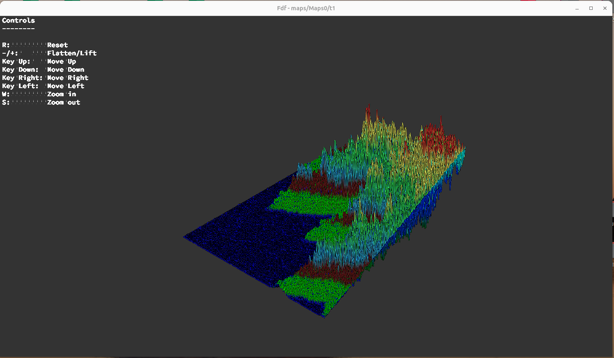

- Visualizador de mapas en 3D proyectados en isométrico, basado en la librería MiniLibX de 42 (MLX42).  
- Lee archivos de mapa (`*.fdf`) con una malla de alturas (enteros).  
- Dibuja una representación de alambre (wireframe) en ventana gráfica.  
- Permite rotar, mover y hacer zoom en tiempo real para explorar la malla.  


```text
08.FdF-main/
├── includes/           
│   └── fdf.h              # Prototipos, structs y defines
├── srcs/                
│   ├── main.c             # Punto de entrada, gestión de MLX
│   ├── parser.c           # Lectura y almacenamiento del mapa
│   ├── draw.c             # Dibujo de líneas en isométrico
│   ├── transform.c        # Cálculo de proyecciones y matrices
│   ├── hooks.c            # Manejo de teclado (rotación/zoom/movimiento)
│   ├── utils.c            # Funciones auxiliares (ft_split, ft_atoi, etc.)
│   └── …
├── maps/                 
│   └── example.fdf        # Ejemplo de mapa de prueba
├── Makefile              # Reglas de compilación y limpieza
└── fdf                   # Ejecutable resultante
```


&nbsp;&nbsp;&nbsp;&nbsp;make

- make all — Compila toda la fuente y genera el ejecutable fdf.

- make clean — Elimina los objetos intermedios (*.o).

- make fclean — Además de clean, elimina fdf.

- make re — Ejecuta fclean y luego all.


- Para ejecutar el programa principal:

```bash
        ./fdf maps/example.fdf
```

- Controles por teclado:

    -  Flechas `←` `↑` `→` `↓` => Mover la vista.

    -  `+` / `-` => Zoom in / out.

    -  `W` / `S` => Rotar en X.

    -  `A` / `D` => Rotar en Y.

    -  `Q` / `E` => Rotar en Z.

    -  `R` => Resetear vista.

    -  `ESC` => Cerrar la ventana y salir.


<p align="center">
  
</p>
<p align="center">
  <

🎥 Puedes descargar o abrir el vídeo de demostración:  
👉 [Ver demo.webm](imgReadme/Vid1.webm)
</p>


- Roberto del Olmo Lima
- [](https://github.com/legrol)
 &nbsp;&nbsp;&nbsp;&nbsp;&nbsp;&nbsp;&nbsp;&nbsp;[](https://www.linkedin.com/in/roberto-del-olmo-731746245)
